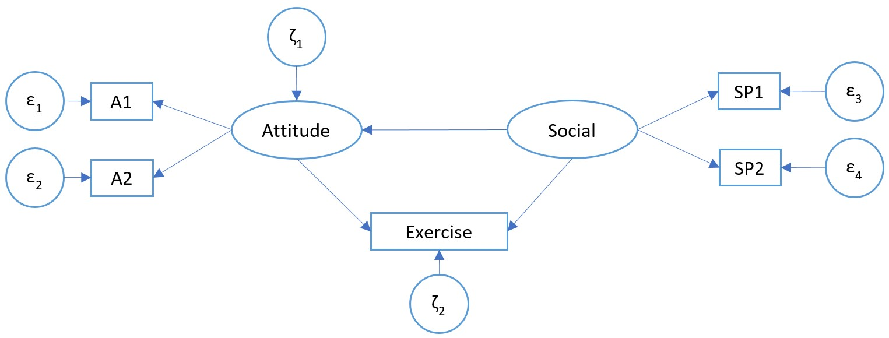

```{r setup, include=FALSE}
knitr::opts_chunk$set(echo = TRUE)
```

# Environment

## Library

```{r}
library(pacman) #package management tool. run install.packages("pacman")
p_load(tidyverse, haven, summarytools, psych, MVN, lavaan, semTools, semPlot)
```


## Dataset

dataset "exercise.sav" was imported directly into R, with vector name "exerciseds"

```{r}
exerciseds0 <- read_sav("Exercise.sav")
exerciseds <- exerciseds0 %>% mutate_if(is.labelled, ~(as_factor(.))) %>% print()
```

# Analysis

## Step 0: Data Exploration

```{r}
descr(exerciseds)
```

Variable A1 and A2 range from 1 - 5, while variable SP1 and SP2 range from 1 - 10 and variable Exercise range from 1 - 7.

There are 200 samples/records, in which no missing data.

## Step 1: Model Conceptualisation

Not applicable. Model was given as in the question

## Step 2: Path Diagram Construction




## Step 3: Model Specification

1. social on attitude
2. social on exercise
3. attitude on exercise (attitude as moderation between social and exercise)

model specification was named as "exermodspec"

```{r}
exermodspec <- "
Exercise ~ c*social + b*attitude
attitude =~ A1 + A2
social =~ SP1 + SP2
attitude ~ a*social
ab := a*b
total := c + a*b
"
```

## Step 4: Model Identification

a - pieces of information
a=$1/2\times\ k\times\left(k+1\right)+$no of intercept
k: no of item
=`r 0.5*5*6 + 4`

b - free information
b= no of factor loading - 1 + no of error variance + no of factor variance + no of factor covariance + no of intercept
=12

## Step 5: Model Parameter Estimation

```{r}
exermodparam <- sem(exermodspec, data = exerciseds)
summary(exermodparam, fit.measure = T, standardized = T)
```

Interpretation

standardized parameter

1. Factor Loading
  + Attitude on A1: 0.649
  + Attitude on A2: 0.810
  + Social on SP1: 0.739
  + Social on SP2: 0.795
2. Regression coefficient
  + Exercise on Social: 0.461
  + Exercise on Attitude: 0.238
  + Attitude on Social: 0.327

Mediation: the regression coefficient between attitude on exercise was not significant, thus there was no mediation.
  
## Step 6: Assessment of Model Fit

```{r}
fitMeasures(exermodparam, c("RMSEA", "SRMR", "CFI", "TLI"))
```

model seems fit


```{r}
residuals(exermodparam, type = "standardized.mplus")
```

there was no large residual, with all standardized residual value lower than 4

```{r}
exermod_mi <- modificationIndices(exermodparam)
subset(exermod_mi, mi > 3.84)
```

there was not items with MI value higher than 3.84

## Step 7: Model Respecification

not done due to model fit.

## Step 8: Model Cross-validation

not done

## SEM Plot

```{r}
exermod_semplot <- semPaths(exermodparam, what = "path", whatLabels = "std", layout = "spring",
                            edge.label.cex = 1.2, nDigits = 3, style = "lisrel", nCharNodes = 0,
                            sizeMan = 8, sizeLat = 9, edge.color = "black")
#png("semplot.png", width = 1024, height = 720, res = 360)
#plot(exermod_semplot)
#dev.off()
```

# Additional - SessionInfo

```{r}
sessionInfo()
```


